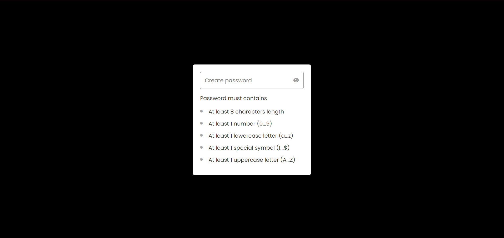

# Dynamic Password Validator

This project is a dynamic password validator implemented in JavaScript. It provides real-time visual feedback to users as they enter passwords, indicating whether the password meets specific security criteria.

## Features

- **Real-time Validation:** As users type, the validator checks if the password meets minimum security requirements, including length, presence of uppercase and lowercase letters, numbers, and special characters.
- **Intuitive Interface:** Password requirements are displayed in a list, with each item visually marked as valid or invalid based on the entered password.
- **Visibility Toggling:** A toggle icon allows users to switch between displaying and hiding the entered password, enhancing user flexibility and convenience during input.

## How to Use

1. Clone this repository to your local environment.
2. Open the `index.html` file in a web browser.
3. Enter a password into the input field and observe the real-time visual feedback on its validity.
4. Use the eye icon to toggle between displaying and hiding the entered password for added security.

## Contributing

Contributions are welcome! If you have any suggestions, feature requests, or bug reports, please [open an issue](https://github.com/yourusername/dynamic-password-validator/issues) or submit a pull request.

## License

This project is licensed under the MIT License. See the [LICENSE](LICENSE) file for details.
